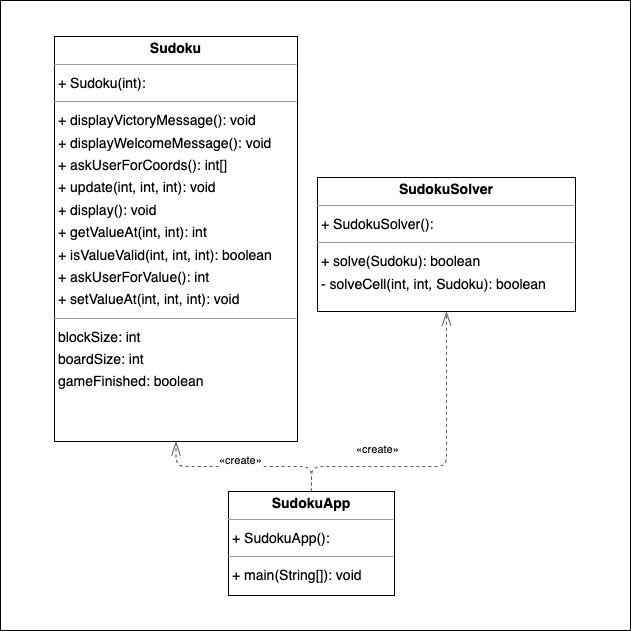

##### Question 1:

##### Question 2 : Quels principes SOLID ne sont pas considérés dans la solution anti-pattern?
### Single Responsibility: 
La classe Soduko étant présentement responsable de la gestion d'entrée utilisateur, la validation de ses dernières et l'affichage du jeu,
ce principe n'est pas respecté.
### Open-Close:
Si de nouvelles fonctionnalités devaient être ajoutée, au niveau de l'interface utilisateur par exemple, la fermeture à la modification du principe ne serait pas respectée.
### Interface Segregation :
Sodoku ne fait pas appel à toutes ses méthodes.
### Dependency Inversion :
Soduku Solver se sert de l'implémentation de Sodoku plutot que de son interface.

#### Question 3, 4: Comment le pattern MVC peut-il aider a resoudre ce probleme ?
Au delà d'une séparation intelligente des besoins et une ouverture organisée à l'extension, 
(Model responsable de la gestion des données du jeu/Controller pour la gestion applicative/Vue pour l'interface) le patron MVC permettrait une lisibilité améliorée du code et par induction une meilleure maintenance,
voir même une optimisation des procédures, par une implémentation de concurrence dans la gestion des processus.

#### Question 5,6 : Avantages des patrons
Composite : Dans la vérification de la validité de la grille, certains comportements sont partagés malgrés des implémentations différentes.
La gestion des caractères à afficher compose un interface complexe que l'implémentation de ce patron gererait efficacement.
Commande: Annuler et répeter les actions de l'utilisateurs, executer les changements de valeurs des cellules.
Observateur : notifier les cellules d'un changement d'état (de valeur)
Stratégie : Choix des algorithmes de résolution de grille.

En contraste, la solution actuelle n'implemente aucuns des avantages listé.
L'enumeration de la violation des principes SOLID (Q2) contient l'inventaire des problèmes relevés de la solution présente.

#### Question 7 : Comment séparer l'application en trois parties distinctes?
Model : Une classe responsable de la gestion des données contenues dans la grille
Controller : Le cerveau de l'application, gérant à partir des entrées utilisateurs, le calcul antérieur à la mise à jour des données dans le modèle.
View : L'interface responsable du display de la partie, et de recevoir les entrées utilisateur.

#### Question 8 : Comment peut-on appliquer le patron Observateur pour que la vue soit notifiee des changements dans le modele ?
En notifiant la vue à la suite d'une procédure effectuée par le controller (rendre les valeurs stockées dans le modèle observable) à partir de l'entrée de l'utilisateur.

#### Question 9: Comment peut-on appliquer le patron Strategie pour que differents algorithmes de resolution du Sudoku puissent etre utilises dans le modele ?
Via un paramètre dans la vue qui permettrait à l'utilisateur de selectionner la stratégie de résolution souhaitée, on set le résultat de ce dernier dans le model
qui serait une implémentation d'un interface commun à toutes les stratégies disponibles.

#### Question 10:
Par une gestion via une collection de commandes (abstraites) disponibles, dont seule les implémentations concrétes intéragiront avec le modèle.

#### Question 11:
En déclarant une structure arborescente telle que le Composite soit un objet interface,comprennant une collection de cellules qui le compose.

### Question 12 et UML MVC: 
A partir de l'approche conceptuelle de mes réponses fournies précedemment aux implémentations des patrons adjacents au MVC,
voici leur implémentation concrète:

